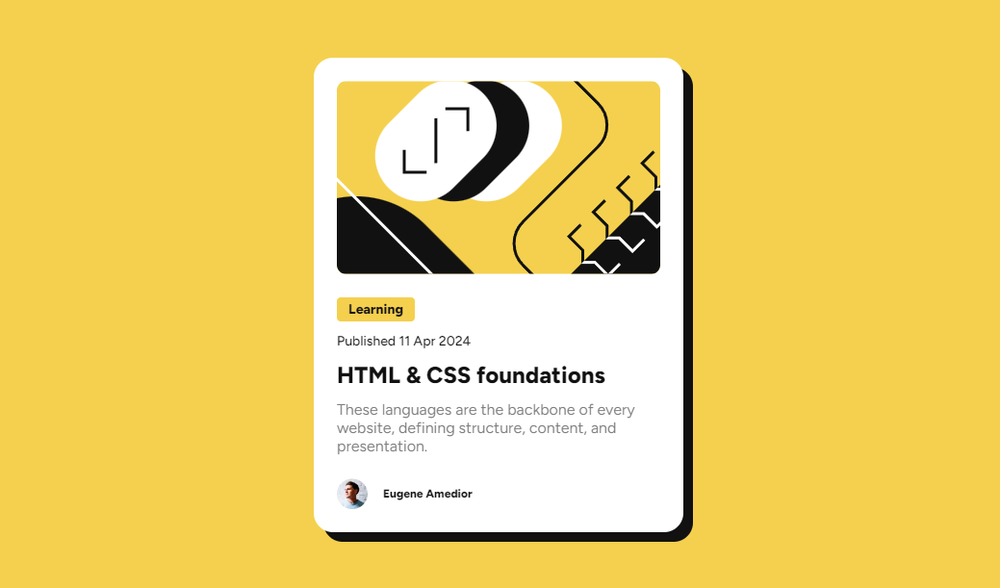

# Frontend Mentor - Blog preview card solution

This is a solution to the [Blog preview card challenge on Frontend Mentor](https://www.frontendmentor.io/challenges/blog-preview-card-ckPaj01IcS). Frontend Mentor challenges help you improve your coding skills by building realistic projects. 

## Table of contents

- [Overview](#overview)
  - [The challenge](#the-challenge)
  - [Screenshot](#screenshot)
  - [Links](#links)
- [My process](#my-process)
  - [Built with](#built-with)
  - [What I learned](#what-i-learned)
  - [Continued development](#continued-development)
  - [Useful resources](#useful-resources)
- [Author](#author)

## Overview

### The challenge

Users should be able to:

- See hover and focus states for all interactive elements on the page

### Screenshot



### Links

- Solution URL: [Github](https://github.com/Eugene-ak/blog-preview-card.git)
- Live Site URL: [Add live site URL here](https://your-live-site-url.com)

## My process

### Built with

- [React](https://reactjs.org/) - JS library
- [Next.js](https://nextjs.org/) - React framework
- CSS Modules - For styles

### What I learned

I learnt to use css modules in next js projects. I also learnt how next js projects work. CSS Modules can be very useful for react or next js projects to avoid collision of class names and styles applied to elements in different files.

It enables you to import a unique class for elements for styling, just like importing any package in javascript applications.

### Continued development

Next js is a great framework for building full stack react applications. However, as a beginner to next js, I encountered problems such as importing local fonts to be used in the application and specifing a particular favicon to be displayed at the top of pages.

For using local fonts in this project, my fallback was to use the css **@font-face** declaration. Although this might have helped, I am still curious of how to achieve the same goal using the **next/font** package. I look forward to finding a solution in my future projects.

### Useful resources

This is a [Next.js](https://nextjs.org/) project bootstrapped with [`create-next-app`](https://github.com/vercel/next.js/tree/canary/packages/create-next-app).

First, run the development server:

```bash
npm run dev
# or
yarn dev
# or
pnpm dev
# or
bun dev
```

Open [http://localhost:3000](http://localhost:3000) with your browser to see the result.

#### Learn More

To learn more about Next.js, take a look at the following resources:

- [Next.js Documentation](https://nextjs.org/docs) - learn about Next.js features and API.
- [Learn Next.js](https://nextjs.org/learn) - an interactive Next.js tutorial.

You can check out [the Next.js GitHub repository](https://github.com/vercel/next.js/) - your feedback and contributions are welcome!


## Author

- Website - [Eugene K. S. Amedior](https://portfolio-website-27ll.onrender.com/)
- Frontend Mentor - [@Eugene-ak](https://www.frontendmentor.io/profile/Eugene-ak)
